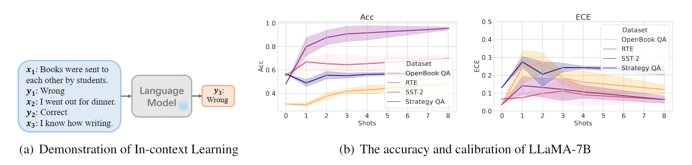

# A Study on the Calibration of In-context Learning



This is the official repo for [A Study on the Calibration of In-context Learning](https://arxiv.org/abs/2312.04021) (NAACL, 2024).


## Dependencies

This code is written using PyTorch and [HuggingFace's Transformer repo](https://github.com/huggingface/pytorch-transformers). If you are running a model locally (e.g., GPT-2), the code requires a single GPU. Running these experiments is relatively lightweight (there is no training).

The easiest way to install the code is to create a fresh anaconda environment:
```
conda create -n icl python=3.10
source activate icl
pip install "fschat[model_worker,webui]"
pip install -r requirements.txt
```

Note that after we refactored our code, the training sets are not the same ones used in our results table. We expect the results to differ slightly but they should match the same trends seen in our results.

## Overview of Codebase

### Data
The `data` folder contains the raw data for numerous tasks. If you'd like to add your own task, add the data into that folder. The code for loading a dataset, as well as defining the prompt format for a task, is in `utils/data_utils.py`. We have loaders for a wide range of existing datasets. If you want to add a new dataset that is similar in structure to any of the existing datasets (e.g., its text classification) adding it should be very simple---you can use an existing dataset as a guide.

### Utils
The `utils` folder contains all of the code for calling the underlying models, getting the probabilities of each label token, possibly applying contextual calibration, and more. If you just want to evaluate few-shot learning on your task, you should not need to modify this code. If you want to extend our code (e.g., modify how decisions are made) this is the place to look.

### Run Scripts for Text Classification Tasks
The run scripts, e.g., `run_classification.py`, contain the code for randomly sampling the examples to use in the prompt, calling the models, the necessary evaluation metrics, and more. If you are adding a new task format (one that is not classification, QA) then you will need to write your own run script. Inside the run script, you can set the parameters for the experiments using the command line arguments.

For all experiments, we save and pickle the outputs of the model. This makes doing a post-hoc analysis of the accuracy / plotting results / etc. very fast. You can also use the saved outputs to evaluate how the accuracy would have changed if a different decision making function was used (e.g., accuracy with and without contextual calibration).

```
model=meta-llama/Llama-2-30b-chat-hf
python run_classification.py \
--model=$model \
--dataset="rte, sst2" \
--num_seeds=5 \
--all_shots="0, 1, 2, 3, 4, 8" \
--subsample_test_set=300 \
--approx 
```

### Run Scripts for Reasoning with Scratchpad Tasks
```
model=meta-llama/Llama-2-30b-chat-hf
python run_classification_cot.py \
--model=$model \
--dataset="open_book_qa_cot, strategy_qa_cot" \
--num_seeds=5 \
--all_shots="0, 1, 2, 3, 4, 8" \
--subsample_test_set=300 \
--approx 
```

### Run Scripts for Scaling-Binning Calibrator
```
model=meta-llama/Llama-2-30b-chat-hf
python run_classification_calibrate.py \
--model=$model \
--dataset="open_book_qa_cot, strategy_qa_cot" \
--num_seeds=5 \
--all_shots="0, 1, 2, 3, 4, 8" \
--subsample_test_set=300 \
--approx 
```


## References

Please consider citing our work if you found this code or our paper beneficial to your research.
```
@misc{zhang2024study,
      title={A Study on the Calibration of In-context Learning}, 
      author={Hanlin Zhang and Yi-Fan Zhang and Yaodong Yu and Dhruv Madeka and Dean Foster and Eric Xing and Himabindu Lakkaraju and Sham Kakade},
      year={2024},
      eprint={2312.04021},
      archivePrefix={arXiv},
      primaryClass={cs.CL}
}
```